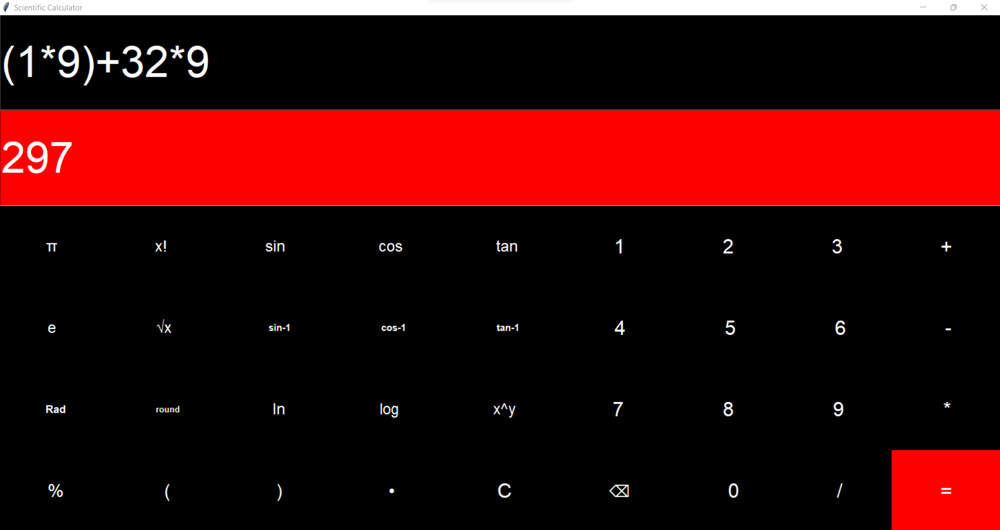

### Hello, This is a GUI calculator created using Python. While making this project, I learnt a lot about Tkinter module. I also brushed up my python skills.

#### To run the file, just fork and clone this repo and run the .py file.

